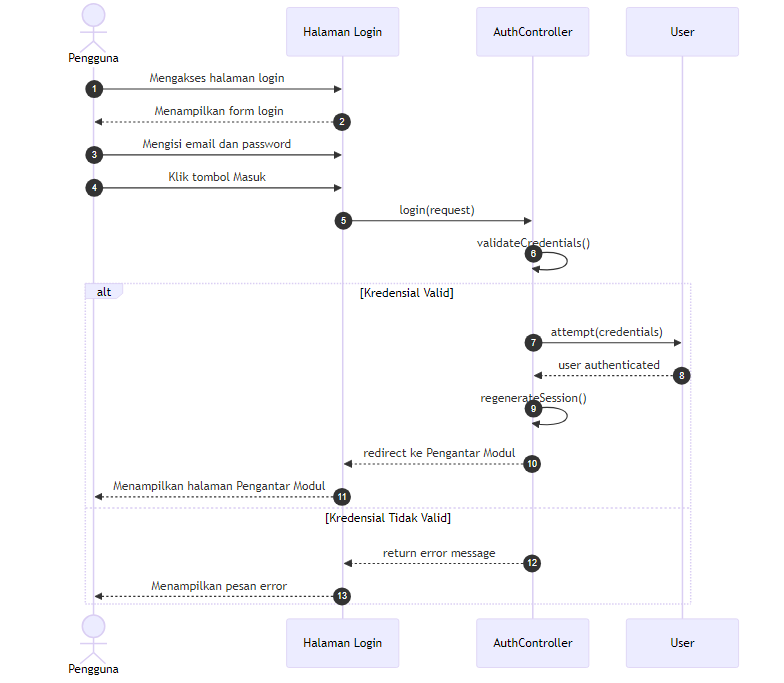
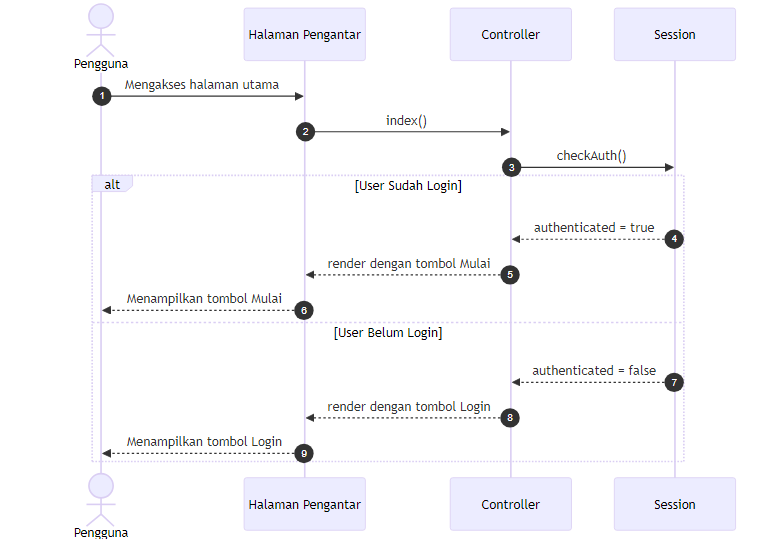
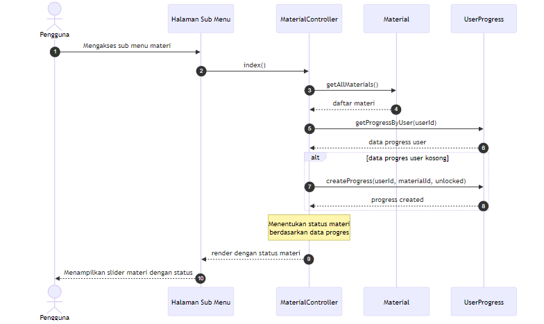
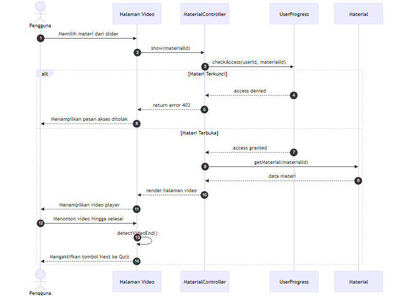
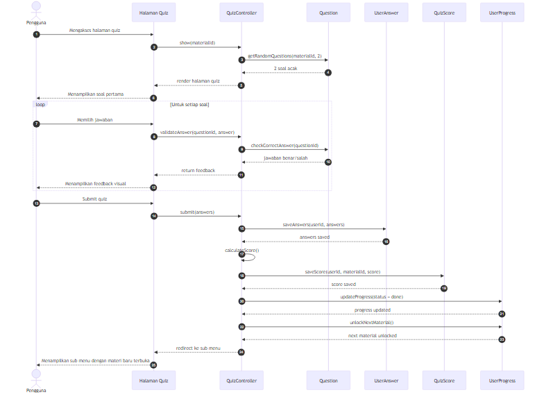
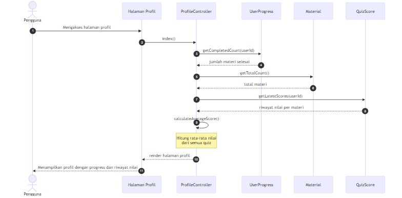

# Sequence Diagram System E-Learning SMKK

Dokumen ini berisi 6 sequence diagram sesuai standar UML untuk laporan Kerja Praktek.

---

## 1. Sequence Diagram: Melakukan Autentikasi Pengguna

Proses login dimulai ketika pengguna mengakses halaman login, mengisi kredensial (email dan password), kemudian sistem memvalidasi dan membuat session jika valid.

### Penjelasan Alur

1. Pengguna mengakses halaman login
2. Sistem menampilkan form login
3. Pengguna mengisi email dan password, lalu klik Masuk
4. AuthController memvalidasi kredensial
5. Jika valid: session dibuat dan redirect ke Pengantar Modul
6. Jika tidak valid: tampilkan pesan error

---

## 2. Sequence Diagram: Mengakses Pengantar Modul

Proses akses halaman utama dengan pengecekan status autentikasi untuk menentukan tombol yang ditampilkan (Login atau Mulai).

### Penjelasan Alur

1. Pengguna mengakses halaman utama
2. Controller mengecek status autentikasi dari session
3. Jika sudah login: tampilkan tombol "Mulai"
4. Jika belum login: tampilkan tombol "Login"

---

## 3. Sequence Diagram: Mengakses Sub Menu Materi

Proses menampilkan daftar materi dengan status progress (terkunci, terbuka, atau selesai) untuk setiap user.

### Penjelasan Alur

1. Pengguna mengakses sub menu materi
2. MaterialController mengambil daftar semua materi
3. Controller mengambil data progress user
4. Jika user baru: inisialisasi progress, materi pertama dibuka
5. Controller menentukan status tiap materi
6. Tampilkan slider materi dengan status masing-masing

---

## 4. Sequence Diagram: Mengakses dan Menonton Video Materi

Proses pemutaran video materi termasuk validasi akses dan deteksi video selesai.

### Penjelasan Alur

1. Pengguna memilih materi dari slider
2. MaterialController mengecek akses user
3. Jika terkunci: tampilkan pesan akses ditolak
4. Jika terbuka: tampilkan video player
5. User menonton video hingga selesai
6. Sistem mendeteksi video selesai dan mengaktifkan tombol Next ke Quiz

---

## 5. Sequence Diagram: Mengerjakan Kuis Evaluasi

Proses quiz dengan pengambilan soal acak, validasi jawaban real-time, perhitungan skor, dan unlock materi berikutnya.

### Penjelasan Alur

1. Pengguna mengakses halaman quiz
2. QuizController mengambil 2 soal acak dari bank soal
3. Untuk setiap soal: user memilih jawaban, sistem validasi dan tampilkan feedback
4. Setelah semua dijawab, user submit quiz
5. Controller menyimpan jawaban dan menghitung skor
6. Update progress materi menjadi selesai
7. Unlock materi berikutnya
8. Redirect ke sub menu dengan materi baru terbuka

---

## 6. Sequence Diagram: Mengelola Profil Pengguna

Proses menampilkan profil dengan agregasi data progress pembelajaran dan riwayat nilai quiz.

### Penjelasan Alur

1. Pengguna mengakses halaman profil
2. ProfileController mengambil jumlah materi yang sudah selesai
3. Controller mengambil total materi
4. Controller mengambil riwayat nilai quiz (hanya nilai terbaru per materi)
5. Controller menghitung rata-rata nilai
6. Tampilkan profil dengan progress video dan riwayat nilai

---

## Ringkasan Sequence Diagram

| No | Sequence Diagram | Controller | Fungsi Utama |
|----|------------------|------------|--------------|
| 1 | Melakukan Autentikasi | AuthController | Validasi login, buat session |
| 2 | Mengakses Pengantar Modul | Controller | Cek status autentikasi |
| 3 | Mengakses Sub Menu Materi | MaterialController | Ambil materi & progress |
| 4 | Menonton Video Materi | MaterialController | Validasi akses, putar video |
| 5 | Mengerjakan Kuis Evaluasi | QuizController | Validasi jawaban, hitung skor, unlock |
| 6 | Mengelola Profil Pengguna | ProfileController | Agregasi progress & nilai |

**Total: 6 Sequence Diagram**
